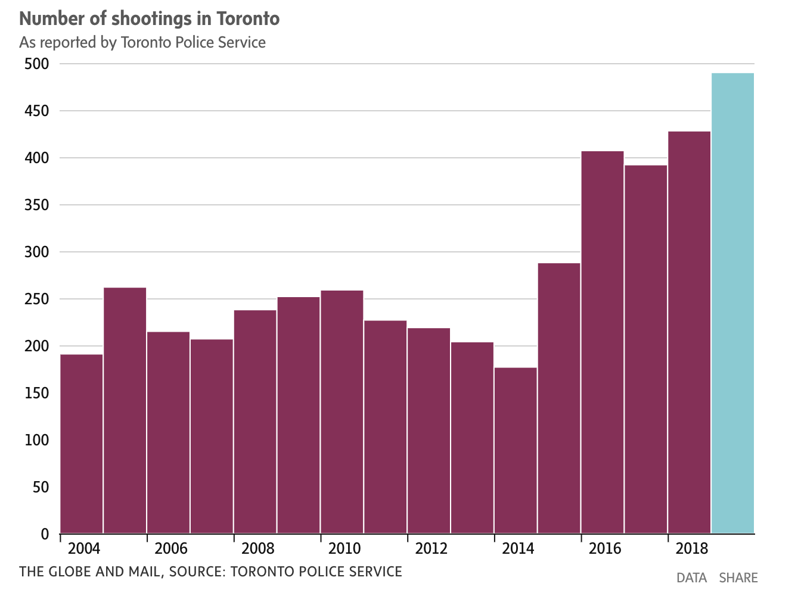
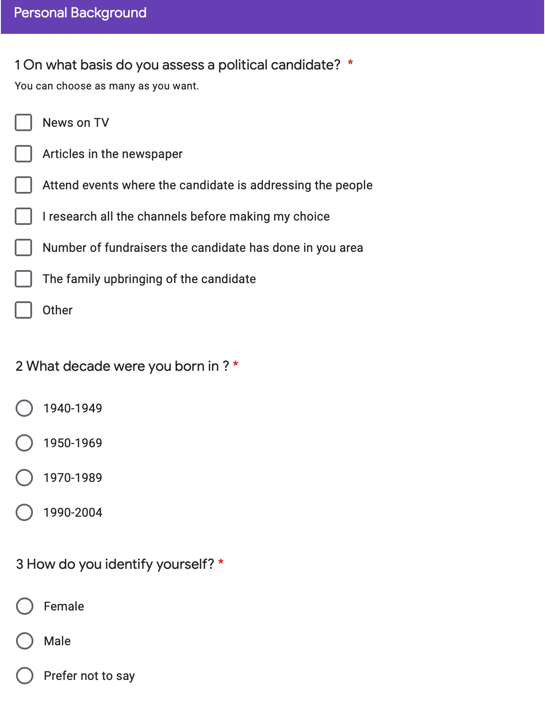
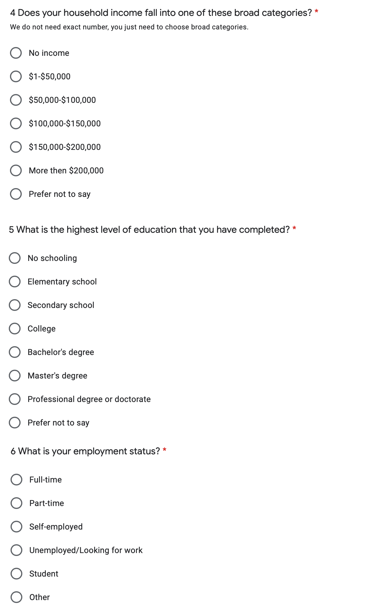
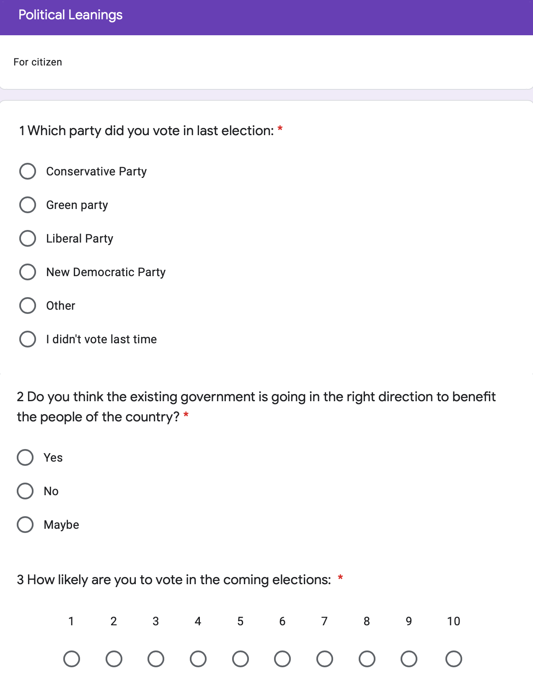
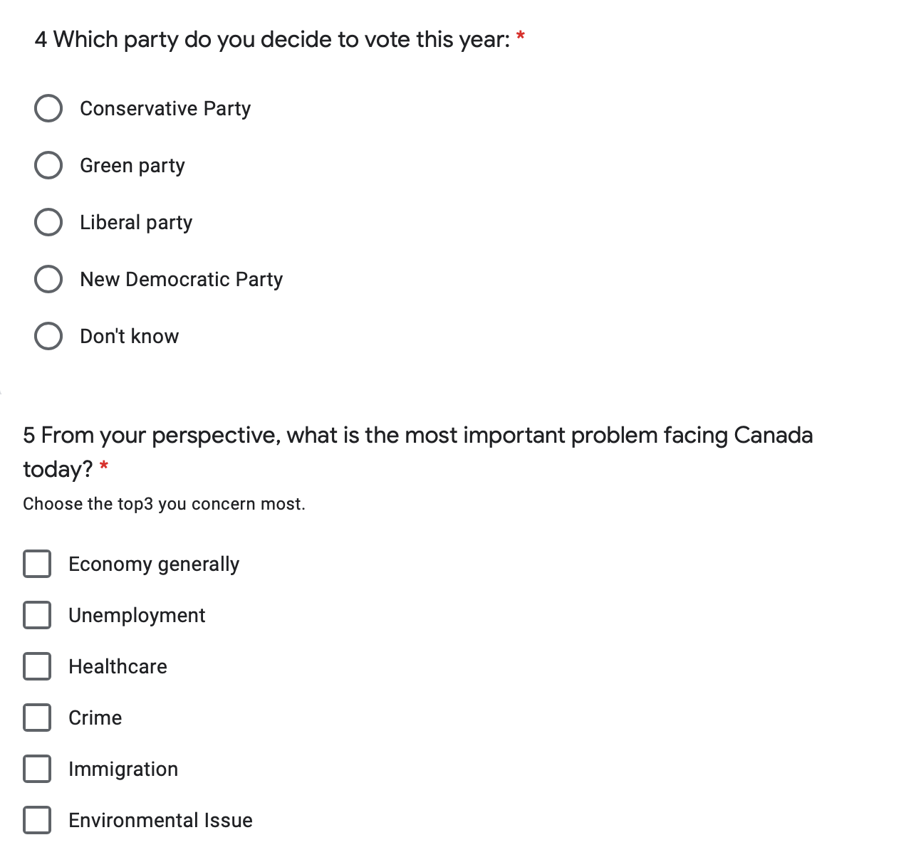
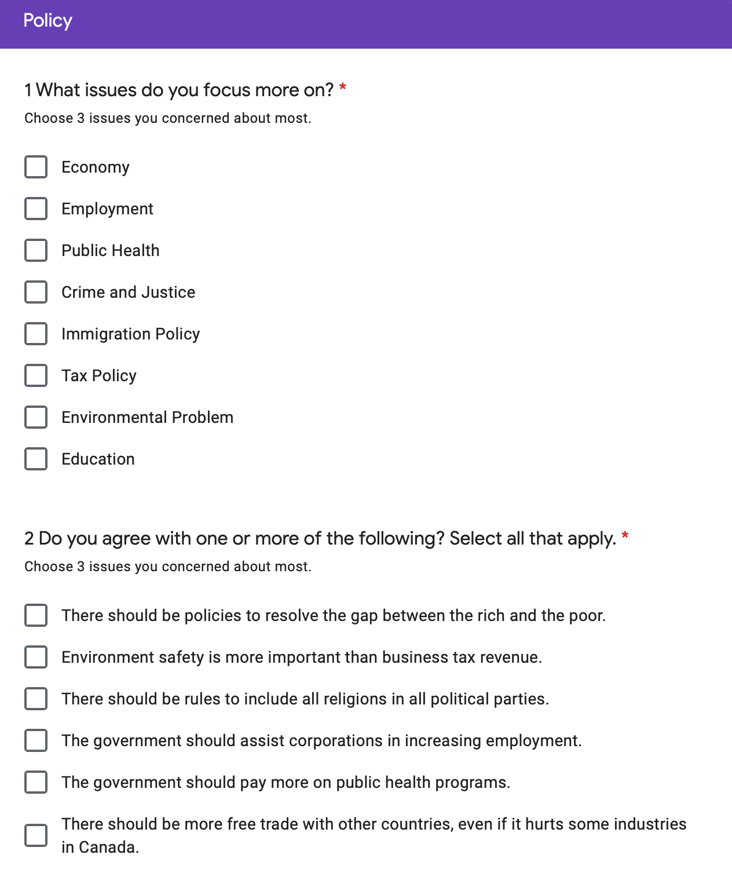

# Executive Summary:
  Petit Poll’s October polling update aims to help the Ontario Liberal party to figure out what kind of problem in Ontario do people care about the most. We developed a survey on Google Form and simulated it in relation to the real-word circumstances, this means we are simulating based on the previous facts for example the percentage of voting in each party. We found that Crime is the most challenging problem for people in Ontario. This is important because the simulation result can be a reference for the Liberal party to know what promise they make during the election will favour people in Ontario the most. However, one weakness is that our report is not based on the real respondent but only an assumption, so the actual result may vary from our result. In this case, the liberal party can take this survey as a template to release a survey on social media to gain some true respondent.
  
# Introduction
  The 43rd Ontario General Election will be held on or before June 2, 2022. From 2003-2014, the Liberal party was elected as premier in Ontario for more than 10 years (TVO, 2018). During the 2018 Ontario election, the Ontario Progressive Conservative Party, led by Doug Ford, won the majority government with 76 out of 124 seats, while the Ontario Liberal Party, led by Kathleen Wynne, recording the worst results in the party’s 161-year history, which dropped from 55 seats to only 7 seats (Dentons, 2018). After changing the leader of the Ontario Liberal Party, it is important for the Liberal Party to gain more seats in the next coming election. One way for doing this is to find out what kind of problem in Ontario do people care about so that the Liberal party would know what campaign promises to pursue if elected.
  
  We developed a survey on Google Form and simulated it in relation to the real-word circumstances to find out what kind of problem worried people in Ontario the most. We use the simple random sampling method, which means everyone in Ontario has an equal chance of being selected. We used a bar plot to find out which problem is the most challenging for people in Ontario. The bar plot shows “Crime” has the highest count among seven different categories. About 150 people among 500 samples think Crime is the problem that the government should put more attention on. 
  
  Use this graph as a reference, the Liberal party can decide on which topic should their campaign promise focus on to attract the voters in Ontario. This graph is a guideline to see which area needs to be improved for the Ontario government. The government who can take action on the improvement may bring people in Ontario a better life. One limitation of this report is that all the results are from simulation but not a real word reflection, although we simulated under the real-world circumstances, it may be different from the real respondents. One suggestion for the party would be to take this survey as a template and release an official survey online to gather reflection from people. 


# Discussion 

## Survey methodology
  In the survey, the population we wish to generalize the findings from is everyone in Ontario. The sampling frame for the Liberal party maybe everyone on their phone number list or everyone who leaves their email address to the Liberal party. Lastly, the sample would be people who take this survey. The sampling method we use for our survey is a simple random sample. In a simple random sample, every member of the population has an equal chance of being selected, which will eliminate the bias.
  
  In considering how to reach the desired respondent, the easiest way is to poll online survey on social media or advertise the survey on the provincial newsletters. The liberal party can also send a dedicated email to their subscribers and people who left their email in the party. Evidence suggests that sending a dedicated email asking people to complete a survey is usually the best way to get a response. Before the election date, the party can also record a short video and request participation in the survey. The ways to reach the respondents, in this case, are easy and straight forward, and the cost will be about $30,000 (SurveyMonkey, 2020).
  
  Nonresponse bias always happened in a survey. It occurs when some respondents included in the sample do not respond. It decreases the sample size, which leads to an increase of statistical variance. Moreover, some sensitive problems that people refuse to answer will impact our critical results (SurveyMonkey, 2020). We'll take the following steps to reduce non-response bias in our survey:
    
  1.	All the questions are needed to be filled out. If respondents have some ignored questions, the questionnaire cannot be submitted. It helps eliminate non-response bias resulted from carelessness.
    
  2.	The questions of the survey are short and simple. We only select the basic background information and the topic we are concerned about the most. 
    
  3.	We'll take some pre-tests in the selected questionnaire platform to ensure our survey runs smoothly for our respondents so that they are more likely to accept our survey request.
    
  4.	We'll extend our survey collection period to two weeks or more to provide our potential respondents more flexibility to fill out the survey. And we'll send some reminders during the collection time to reduce non-response bias as many as possible.
  
  Finally, we take the following measure to protect respondent privacy:
    
  1.	We set an option called "prefer not to say " in the sensitive questions of personal background.
    
  2.	We promise that personal information cannot be provided to other organizations or for other purposes.
    
  3.	The information collected from respondents cannot be altered by the researcher.

## Results


```{r setup, include=FALSE}
# Setting seed as the last 4 digits of my student number
set.seed(4759)
library(tidyverse)
# Global settings for figure sizes and echo.
knitr::opts_chunk$set(echo = FALSE, fig.pos = 'H')
knitr::opts_chunk$set(message = F)
knitr::opts_chunk$set(warning = F)
library(tibble)
library(dplyr)
library(ggplot2)
```


```{r "Data Simulation", include=FALSE}
# We begin with storing choices in vectors
# which will be used for sampling in the next chunk
# For section 'citizenship'
citizenship <- c("Canadian Citizen", "Permanent Resident", "Other")
# For section 'Personal Background'
# On what basis do you assess a political candidate?
basis <- c("News on TV", "Articles in the newspaper", "Attend events where the candidate is addressing the people", "I research all the all the channels before making my choice", "Number of fundraisers the candidate has done in you area", "The family upbringing of the candidate", "Other")
# What decade were you born in? 
decade <- c('1940-1949', '1950-1969', '1970-1989', '1990-2004')
# How do you identify yourself?
gender <- c("Female", "Male", "Prefer not to say")
# Does your household income fall into one of these broad ranges?
income <- c("0", "$1-$50,000", "$50,000-$100,000", "$100,000-$150,000", "$150,000-$200,000", "More then $200,000", "Prefer not to say")
# What is the highest level education that you have completed?
education <- c("No schooling", "Completed elementary school", "Completed high school", "Completed technical, community College, CEGEP, collage Classique", "Bachelor's degree", "Master's degree", "Professional degree or doctorate", "Prefer not to say")
# What is your employment status?
employment <- c("Working for pay full-time", "Working for pay part-time", "Self-employed", "Unemployed/looking for work", "Student", "Other")
# If you could vote in this election, which party do you think you will vote for?
# We use the vector 'party' below
# party_noncitizen <- c("Liberal", "Conservative", "NDP", "Green", "Other")
# ADD NONCITIZEN?
# ---
# Section Political Leanings, citizen
party <- c("Liberal", "Conservative", "NDP", "Green", "Other")
# Which party did you vote in last election?
last_vote <- c("Liberal", "Conservative", "NDP", "Green", "Other")
# Do you think the existing government is going in the right direction to benefit the people of the country?
right_dir <- c("Yes", "No", "Maybe")
# How likely are you gonna vote in the upcoming
likely_vote <- c(1:10)
# Which party are you gonna vote?
will_vote <- c("Liberal", "Conservative", "NDP", "Green", "Don't know")
# What’s the most important problem facing Canada today?
problem <- c("Economy generally", "Unemployment", "Healthcare", "Crime", "Immigration", "Environmental Issue", "Other")
# ---
# Choices for section 'Policy'
# What issue do you focus more on?
focus_issue <- c("Economy", "Employment", "Public Health", "Prime and Justice", "Immigration Policy", "Tax Policy", "")
# Do you agree with one or more of the following? Select all that apply.
agree_statements <- c("There should be policies to resolve the gap between the rich and the poor.", "Environment safety is more important than business tax revenue.", "There should be rules to include all religions in all political parties.", "The government should assist corporations in increasing employment.", "The government should pay more on public health programs.", "There should be more free trade with other countries, even if it hurts some industries in Canada.")
# Simuating data using the sample function
# setting sample size
n <- 500
# Simulating n samples answers to section 'Personal Background'
background <- tibble(basis = sample(x = basis, size=n, replace=TRUE), 
             citizenship = sample(x=citizenship, size=n, replace=TRUE, prob = c(0.8, 0.1, 0.1)),
             decade_born = sample(x=decade, size=n, replace=TRUE),
             education_level = sample(x=education, size=n, replace=TRUE),
             gender = sample(x=gender, size=n, replace=TRUE, prob = c(0.4915, 0.4915, 0.017))# based on the referenced, that there exists 1.7% population identified them 'Non-binary' in Canada [NonBin].
             , employment_status = sample(x=employment, size=n, replace=TRUE))
# [Education] Reference https://www12.statcan.gc.ca/census-recensement/2016/dp-pd/hlt-fst/edu-sco/Table.cfm?Lang=E&T=11&Geo=00&SP=1&view=2&age=2&sex=1
# [NonBin] https://www.statcan.gc.ca/eng/dai/smr08/2015/smr08_203_2015
# Simulating n samples answering section 'Political Leanings'
political_leaning <- tibble(last_vote = sample(x=last_vote, size=n, replace=TRUE, prob=c(0.1965, 0.4136, 0.3429, 0.0047, 0)),
                            likely_vote = sample(x=likely_vote, size=n, replace=TRUE),
                            problem_focused = sample(x=problem, size=n, replace=TRUE, prob = c(0.1,0.05,0.05,0.3,0.1,0.125,0.125)),
                            right_direction = sample(x=right_dir, size=n, replace=TRUE, prob = c(0.3, 0.6, 0.1)),
                            will_vote = sample(x=party, size=n, replace=TRUE, prob = c(0.5, 0.3, 0.15, 0.025, 0.025)),
                            )
# Combining sections' Answers
election_data <- bind_cols(background, political_leaning)
election_data <- election_data %>% subset(citizenship=="Canadian Citizen")
```

```{r "Data Tuning based on Facts"}
# Research & References required

```


```{r makeGraph1, echo = FALSE, fig.cap = "Distribution of which parties the samples voted in the previous election", fig.width= 6, fig.height=4}
# We use ggplot to generate the following figures
# Plotting the distribution of which parties were voted in the last election
last_vote_frame <- election_data %>% group_by(last_vote) %>% summarise(count = n())
total = sum(last_vote_frame$count)
last_vote_figure <- ggplot(last_vote_frame, aes(x="last_vote", y=count, fill=last_vote)) +
  theme_void() +
  geom_bar(width = 2, stat = "identity") + 
  coord_polar("y", start=0) + 
  geom_text(aes(label = paste0(round(count/total*100), "%")), 
            color="black",position = position_stack(vjust = 0.5))
last_vote_figure
```

```{r makeGraph2, echo = FALSE, fig.cap = "Distribution to question if the existing gov is bringing benefits to country?", fig.width= 6, fig.height=4}
# Answer distribution to question "Do you think the existing gov' is bringing benefits to country? "

right_direction_frame <- election_data %>% group_by(right_direction) %>% summarise(count = n())
total = sum(right_direction_frame$count)
right_direction_figure <- ggplot(right_direction_frame, aes(x="last_vote", y=count, fill=right_direction)) +
  theme_void() +
  geom_bar(width = 2, stat = "identity") + 
  coord_polar("y", start=0) + 
  geom_text(aes(label = paste0(round(count/total*100), "%")), 
            color="black",position = position_stack(vjust = 0.5))
right_direction_figure
```

```{r makeGraph3, echo = FALSE, fig.cap = "Distribution of which parties to vote for in the next election", fig.width= 6, fig.height=4}
# Distribution of which parties to vote for in the next election.
next_vote_frame <- election_data %>% group_by(will_vote) %>% summarise(count = n())
total = sum(next_vote_frame$count)
next_vote <- ggplot(next_vote_frame, aes(x="will_vote", y=count, fill=will_vote )) + 
  theme_void() +
  geom_bar(width = 2, stat = "identity") + 
  coord_polar("y", start=0) + 
  geom_text(aes(label = paste0(round(count/total*100), "%")), 
            color="black",position = position_stack(vjust = 0.5))
next_vote
# Distribution of which parties to vote for in the next election; colors indicates whether the voter agrees that 
```

Among the 500 questionnaires we sampled, the number of people who voted for the Conservative Party in the last poll accounted for a maximum of 44%. It was followed by the NDP Party with 33% of the vote. The Liberal and the Green Party received 23% and nearly 0% support respectively (Figure 1). However, in the forecast for a new vote, the number of people willing to vote for the Liberal Party soared to 47% (Figure 3). It also shows that the masses are dissatisfied with the performance of the Conservative Party in Ontario. Statistics confirmed this feedback. 55% of the people expressed dissatisfaction with the current government (Figure 2).

\clearpage

The Liberal Party needs to strengthen where it did not do well in the previous government. According to our questionnaire survey, crime has become the most concerned issue (Figure 4), accounting for 31%. There were 490 shootings in Toronto last year and the city also set a record for shooting-related injuries, at 248 (JANUARY 1, 2020). The data also proves that crime incidents have been on the rise in recent years and the problem needs to be solved urgently (Figure 6).
  
  From the perspective of the answering population, our student population is too large (Figure 5), which may be due to the fact that the questionnaire adopts the form of an online questionnaire, which leads to bias.

```{r makeGraph4, echo = FALSE, fig.cap = "Distribution of questions people focused on", fig.width= 6, fig.height=4}
problem_focused_frame <- election_data %>% group_by(problem_focused) %>% summarise(count = n())
total = sum(problem_focused_frame$count)
problem_focused <- ggplot(problem_focused_frame, aes(x="problem_focused",y=count, fill=problem_focused)) + geom_bar(width = 2, stat = "identity") + 
  theme_void() +
  coord_polar("y") +
  geom_text(aes(label = paste0(round(count/total*100), "%")), 
            color="black",position = position_stack(vjust = 0.5))
problem_focused

```

```{r makeGraph5, echo = FALSE, fig.cap = "Distribution of employment count", fig.width= 8, fig.height=4}
employment_count <- c()
for (i in 1:9){
  employment_count[i] <- ncol(election_data %>% filter(employment_status == employment[i]))
}
# employment_pie <- ggplot(election_data, aes(x="", y=employment_count, fill=employment_status)) + geom_bar(width=1, stat = "identity") + 
#   coord_polar("y", start=0)
# 
# employment_pie
employment_dist_dir_fill <- ggplot(election_data, aes(x=employment_status, fill = problem_focused)) + geom_bar() + coord_flip()
employment_dist_dir_fill
```



\clearpage

# Reference

  - Alamenciak, T., Author Portrait Image Tim Alamenciak, Portrait Image Tim Alamenciak, Image, P., Alamenciak, T., Description TVO Staff, & Follow @TheAgenda !function (d. (n.d.). The good, the bad, and the ugly: A look back at 15 years of Liberal government. Retrieved October 08, 2020, from https://www.tvo.org/article/the-good-the-bad-and-the-ugly-a-look-back-at-15-years-of-liberal-government

  - How to avoid nonresponse errors. (n.d.). Retrieved October 08, 2020, from https://www.surveymonkey.com/mp/how-to-avoid-nonresponse-error/

  - JJ Allaire and Yihui Xie and Jonathan McPherson and Javier Luraschi and Kevin Ushey and Aron Atkins and Hadley Wickham and Joe Cheng and Winston Chang and Richard Iannone (2020). rmarkdown: Dynamic Documents for R. R package version 2.4. URL
https://rmarkdown.rstudio.com.

  - Online Survey Software: Create Your Survey in Minutes " FluidSurveys. (2016, June 21). Retrieved October 08, 2020, from http://fluidsurveys.com/university/how-to-ensureyour-respondents-privacy/
  
  - R Core Team (2020). R: A language and environment for statistical computing. R Foundation for Statistical Computing, Vienna, Austria. URL
https://www.R-project.org/.

  - Stephenson, L., Harell, A., Rubenson, D., & Loewen, P. (2020, May 01). 2019 Canadian Election Study - Online Survey. Retrieved October 08, 2020, from https://dataverse.harvard.edu/dataset.xhtml?persistentId=doi%3A10.7910%2FDVN%2FDUS88V

  - SurveyMonkey. (n.d.). Pick Your Audience. Retrieved October 08, 2020, from https://www.surveymonkey.com/collect/audience/preview/

  - Top 25 Political Survey Questions for Questionnaires. (2020, May 17). Retrieved October 08, 2020, from https://www.questionpro.com/blog/political-survey-questions/

  - Wickham et al., (2019). Welcome to the tidyverse. Journal of Open Source Software, 4(43), 1686,
https://doi.org/10.21105/joss.01686

  - 2018 Ontario Election summary. (n.d.). Retrieved October 08, 2020, from https://www.dentons.com/en/insights/alerts/2018/june/11/2018-ontario-election-summary

  - 43rd Ontario general election. (2020, September 26). Retrieved October 08, 2020, from https://en.wikipedia.org/wiki/43rd_Ontario_general_election
  
  - Toronto sees record number of shootings in 2019, but fewer deaths,PUBLISHED (JANUARY 1, 2020)
https://www.theglobeandmail.com/canada/toronto/article-toronto-sees-record-number-of-shootings-in-2019-but-fewer-deaths/

\clearpage

# Appendix

The Survey link down below: 
  https://docs.google.com/forms/d/e/1FAIpQLScHpDE2n-2QJevoEdasLFhEeWXmGuGLT8Zq7o2QyoQNS1DzcQ/formResponse

The code that generates the simulated data can be found here:
  https://github.com/Xeon0312/sta304-ps2/blob/master/simulation-script.R
  
The R markdown file that generated this report is here:
  https://github.com/Xeon0312/sta304-ps2/blob/master/304-simulating.Rmd
  
github repo: https://github.com/Xeon0312/sta304-ps2
  











