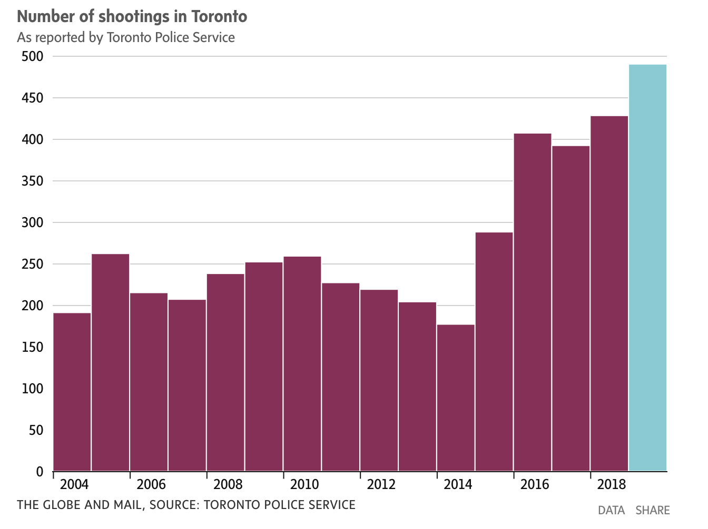
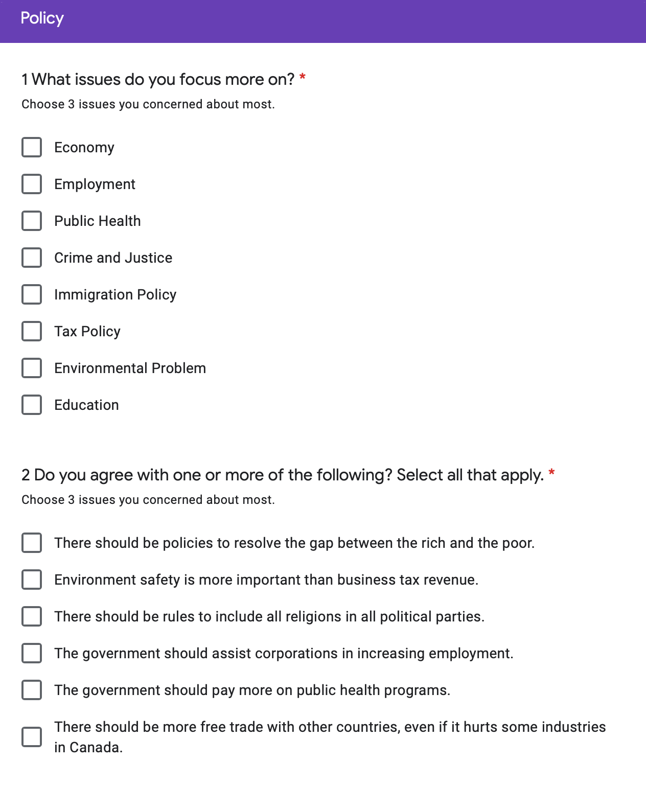

```{r, include=FALSE, cache=FALSE}
# Importing simulated data
# knitr::read_chunk('simulation.R')
source('simulation.R')
```

```{r setup, include=FALSE}
# Setting seed as the last 4 digits of Ziyue Yang's student number
set.seed(4759)
library(tidyverse)

# Global settings for figure sizes and echo.
knitr::opts_chunk$set(echo = FALSE, fig.pos = 'H')
knitr::opts_chunk$set(message = F)
knitr::opts_chunk$set(warning = F)
```

# Executive Summary

Petit Poll’s October polling update aims to help the Ontario Liberal Party to figure out what problems Ontario residents care about the most. We developed a *Google Form* survey and simulated responses, based on the real-word circumstances -- we simulated the data based on facts about Ontario, say, the percentage of votes each party gained during the 43^rd^ federal election in Ontario. We discovered that the existence of **crime** is the most concerning problem in Ontario. Our simulation plays a crucial role since the results can be a reference for the Liberal Party to know what promises to give during the election will favor people in Ontario the most. A weakness of the design is that our report is not based on the real respondent but only an assumption, so the actual result may vary from our results. In this case, the liberal party can take this survey as a template to release a survey on social media to gain true respondents.

# Introducion

The 43^rd^ Ontario General Election will be held on or before June 2, 2022. From 2003-2014, the Liberal Party was elected as premier in Ontario for more than 10 years (TVO, 2018). During the 2018 Ontario election, the Ontario Progressive Conservative Party, led by Doug Ford, won the majority government with 76 out of 124 seats, while the Ontario Liberal Party, led by Kathleen Wynne, recording the worst results in the party’s 161-year history, which dropped from 55 seats to only 7 seats (Dentons, 2018). After the leader of the Ontario Liberal Party has changed, the Liberal Party needs to gain more seats in the next coming election. One way for doing this is to find out what kind of problem in Ontario do people care about so that the Liberal Party would know what campaign promises to pursue if elected.

We developed a survey on Google Form and simulated it in relation to the real-word circumstances to find out what kind of problem worried people in Ontario the most. We use the simple random sampling method, which means everyone in Ontario has an equal chance of being selected. We used pie charts to find out which problem is the most challenging for people in Ontario. Figure 4 shows “Crime” has the highest count among seven different categories. About 155 people among 500 samples think Crime is the problem that the government should put more attention on.

Use this report as a reference, the Liberal party can decide on which topic should their campaign promise focus on to attract the voters in Ontario. This report is a guideline to see which area needs to be improved for the Ontario government. The government who can take action on the improvement may bring people in Ontario a better life. One limitation of this report is that all the results are from simulation but not a real word reflection, although we simulated under the real-world circumstances, it may be different from the real respondents. One suggestion for the party would be to take this survey as a template and release an official survey online to gather reflection from people.


# Survey Methodologies

In the survey, the population we wish to generalize the findings from is everyone in Ontario. The sampling frame for the Liberal Party maybe everyone on their phone number list or everyone who leaves their email address to the Liberal Party. Lastly, the sample would be people who take this survey. The sampling method we use for our survey is a simple random sample. In a simple random sample, every member of the population has an equal chance of being selected, which will eliminate the bias.

In considering how to reach the desired respondent, the simplest way is to poll online survey on social media or advertise the survey on the provincial newsletters. The Liberal Party can also send a dedicated email to their subscribers and people who left their email in the political party. Evidence suggests that sending a dedicated email asking people to complete a survey is usually the best way to get a response. Before the election date, the political party can also record a short video and request participation in the survey. The ways to reach the respondents, in this case, are easy and straight forward, and the cost will be about $30,000 (SurveyMonkey, 2020).

Non-response bias always happened in a survey. It occurs when some respondents included in the sample do not respond. It decreases the sample size, which leads to an increase of statistical variance. Moreover, some sensitive problems that people refuse to answer will impact our critical results (SurveyMonkey, 2020). We'll take the following steps to reduce non-response bias in our survey:

1. All the questions are needed to be filled out. If respondents have some ignored questions, the questionnaire cannot be submitted. It helps eliminate non-response bias resulted from carelessness.

2. The questions of the survey are short and simple. We only select the basic background information and the topic we are concerned about the most.

3. We will take some pre-tests in the selected questionnaire platform to ensure our survey runs smoothly for our respondents so that they are more likely to accept our survey request.

4. We will extend our survey collection period to two weeks or more to provide our potential respondents more flexibility to fill out the survey. And we'll send some reminders during the collection time to reduce non-response bias as many as possible.

Finally, we take the following measure to protect respondent privacy:

1. We include an option called "prefer not to say" in the sensitive questions of
personal background.

2. We promise that personal information cannot be provided to other
organizations or for other purposes.

3. The information collected from respondents cannot be altered by the
researcher.

# Results

Among the 500 questionnaires we sampled, the number of people who voted for the Conservative Party in the last election accounted for 44%, which is the highest amongst the parties. It was followed by the NDP Party with 33% of the vote. The Liberal and the Green Party received 23% and nearly 0% support respectively (Figure 1). However, in the forecast for a new vote, the number of people willing to vote for the Liberal Party soared to 47% (Figure 3). It also shows that more than half of the respondents are dissatisfied with the performance of the Conservative Party in Ontario. Statistics confirmed this feedback, 55% of the people expressed that the current government is not going in the right direction to benefit people in the province (Figure 2).

```{r makeGraph1, echo = FALSE, fig.cap = "Distribution of which parties the samples voted in the previous election", fig.width= 6, fig.height=4}
# We use ggplot to generate the following figures
# Plotting the distribution of which parties were voted in the last election
last_vote_frame <- election_data %>% group_by(last_vote) %>% summarise(count = n())
total = sum(last_vote_frame$count)
last_vote_figure <- ggplot(last_vote_frame, aes(x="last_vote", y=count, fill=last_vote)) +
  theme_void() +
  geom_bar(width = 2, stat = "identity") + 
  coord_polar("y", start=0) + 
  geom_text(aes(label = paste0(round(count/total*100), "%")), 
            color="black",position = position_stack(vjust = 0.5)) + guides(fill=guide_legend(title="Party Voted in the Previous Election"))
last_vote_figure
```

```{r makeGraph2, echo = FALSE, fig.cap = "Distribution to question if the existing government is bringing benefits to the country?", fig.width= 6, fig.height=4}
# Answer distribution to question "Do you think the existing gov' is bringing benefits to country? "

right_direction_frame <- election_data %>% group_by(right_direction) %>% summarise(count = n())
total = sum(right_direction_frame$count)
right_direction_figure <- ggplot(right_direction_frame, aes(x="last_vote", y=count, fill=right_direction)) +
  theme_void() +
  geom_bar(width = 2, stat = "identity") + 
  coord_polar("y", start=0) + 
  geom_text(aes(label = paste0(round(count/total*100), "%")), 
            color="black",position = position_stack(vjust = 0.5)) + guides(fill=guide_legend(title="Bringing Benefits"))
right_direction_figure
```

```{r makeGraph3, echo = FALSE, fig.cap = "Distribution of which parties to vote for in the next election", fig.width= 6, fig.height=4}
# Distribution of which parties to vote for in the next election.
next_vote_frame <- election_data %>% group_by(will_vote) %>% summarise(count = n())
total = sum(next_vote_frame$count)
next_vote <- ggplot(next_vote_frame, aes(x="will_vote", y=count, fill=will_vote )) + 
  theme_void() +
  geom_bar(width = 2, stat = "identity") + 
  coord_polar("y", start=0) + 
  geom_text(aes(label = paste0(round(count/total*100), "%")), 
            color="black",position = position_stack(vjust = 0.5)) + guides(fill=guide_legend(title="Party to Vote for"))
next_vote
# Distribution of which parties to vote for in the next election; colors indicates whether the voter agrees that 
```

The Liberal Party needs to strengthen the policy where it did not do well in the previous government. According to our survey, Crime has become the most concerning issue for people in Ontario, accounting for 31% in all different sources of problems (Figure 4). There were 490 shootings in Toronto last year and the city also set a record for shooting-related injuries, at 248 (JANUARY 1, 2020). The data also proves that crime incidents have been on the rise in recent years and the problem needs to be solved urgently (Figure 6). Other problems that people focused on should also be taken into consideration. For example, the environmental issue is also high compare to other issues, 16% of the respondents think it is a serious problem in Ontario (Figure 4).

Among all the people in different employment statuses, the group *student* is mostly concerned regarding unemployment status among the population (Figure 5), which may be due to the fact that the questionnaire adopts the form of an online survey, which leads to some biases. Another reason may be students are just having the right to vote, so they are more passionate in answering the questions about the election. They have their own opinion about the policy and government, which may be different from the elders. It is important in this case to take their opinion seriously. Similarly, students, like other people, think Crime is the most serious problem in Ontario (Figure 5). They also think other problems that we haven’t included in the questionnaire are also important (Figure 5). We may develop a writing space for people who have opinions other than the selections next time.

```{r makeGraph4, echo = FALSE, fig.cap = "Distribution of questions people focused on", fig.width= 6, fig.height=4}
problem_focused_frame <- election_data %>% group_by(problem_focused) %>% summarise(count = n())
total = sum(problem_focused_frame$count)
problem_focused <- ggplot(problem_focused_frame, aes(x="problem_focused",y=count, fill=problem_focused)) + geom_bar(width = 2, stat = "identity") + 
  theme_void() +
  coord_polar("y") +
  geom_text(aes(label = paste0(round(count/total*100), "%")), 
            color="black",position = position_stack(vjust = 0.5)) + guides(fill=guide_legend(title="Problem Concerned"))
problem_focused
```

```{r makeGraph5, echo = FALSE, fig.cap = "Distribution of employment count", fig.width= 8, fig.height=4}
employment_count <- c()
for (i in 1:9){
  employment_count[i] <- ncol(election_data %>% filter(employment_status == employment[i]))
}

employment_dist_dir_fill <- ggplot(election_data, aes(y=employment_status, fill = problem_focused)) + geom_bar() + guides(fill=guide_legend(title="Problem Concerned"))
employment_dist_dir_fill
```



\clearpage


# Limitaions and Weaknesses

There exists various limitations in the survey.

Although the data is simulated based on real-world circumstances (e.g. we tuned the probability for each political party being voted based on results from the 2019 Federal Election in Ontario, a major problem is that the samples might be dissimilar to the real-world respondents, such that it leads to false results.

A potential solution is to take this survey as a template and release an official survey online to gather reflection from people.

In addition, the simulated data is lack of multivariate responses. For instance, in the questionnaire we created, respondents are allowed to select up to a specific number of responses (e.g. Question 5 in Figure 11, see Appendix), but in contrast, the simulated data does not include any sample having multiple responses to one specific question. The issue exists because of insufficient methodology to analyze multivariate categorical data, due to our limited knowledge.


# Reference

  - Alamenciak, T., Author Portrait Image Tim Alamenciak, Portrait Image Tim Alamenciak, Image, P., Alamenciak, T., Description TVO Staff, & Follow @TheAgenda !function (d. (n.d.). The good, the bad, and the ugly: A look back at 15 years of Liberal government. Retrieved October 08, 2020, from https://www.tvo.org/article/the-good-the-bad-and-the-ugly-a-look-back-at-15-years-of-liberal-government

  - How to avoid nonresponse errors. (n.d.). Retrieved October 08, 2020, from https://www.surveymonkey.com/mp/how-to-avoid-nonresponse-error/

  - JJ Allaire and Yihui Xie and Jonathan McPherson and Javier Luraschi and Kevin Ushey and Aron Atkins and Hadley Wickham and Joe Cheng and Winston Chang and Richard Iannone (2020). rmarkdown: Dynamic Documents for R. R package version 2.4. URL
https://rmarkdown.rstudio.com.

  - Online Survey Software: Create Your Survey in Minutes " FluidSurveys. (2016, June 21). Retrieved October 08, 2020, from http://fluidsurveys.com/university/how-to-ensureyour-respondents-privacy/
  
  - R Core Team (2020). R: A language and environment for statistical computing. R Foundation for Statistical Computing, Vienna, Austria. URL
https://www.R-project.org/.

  - Stephenson, L., Harell, A., Rubenson, D., & Loewen, P. (2020, May 01). 2019 Canadian Election Study - Online Survey. Retrieved October 08, 2020, from https://dataverse.harvard.edu/dataset.xhtml?persistentId=doi%3A10.7910%2FDVN%2FDUS88V

  - SurveyMonkey. (n.d.). Pick Your Audience. Retrieved October 08, 2020, from https://www.surveymonkey.com/collect/audience/preview/

  - Top 25 Political Survey Questions for Questionnaires. (2020, May 17). Retrieved October 08, 2020, from https://www.questionpro.com/blog/political-survey-questions/

  - Wickham et al., (2019). Welcome to the tidyverse. Journal of Open Source Software, 4(43), 1686,
https://doi.org/10.21105/joss.01686

  - 2018 Ontario Election summary. (n.d.). Retrieved October 08, 2020, from https://www.dentons.com/en/insights/alerts/2018/june/11/2018-ontario-election-summary

  - 43rd Ontario general election. (2020, September 26). Retrieved October 08, 2020, from https://en.wikipedia.org/wiki/43rd_Ontario_general_election
  
  - Toronto sees record number of shootings in 2019, but fewer deaths,PUBLISHED (JANUARY 1, 2020)
https://www.theglobeandmail.com/canada/toronto/article-toronto-sees-record-number-of-shootings-in-2019-but-fewer-deaths/

\clearpage

# Appendix

1.  Link to the survey down below

https://docs.google.com/forms/d/e/1FAIpQLScHpDE2n-2QJevoEdasLFhEeWXmGuGLT8Zq7o2QyoQNS1DzcQ/formResponse

2. Code that generates the simulated data can be found here:

https://github.com/Xeon0312/sta304-ps2/blob/master/simulation-script.R
  
3. The R markdown file that generated this report is here:

https://github.com/Xeon0312/sta304-ps2/blob/master/304-simulating.Rmd
  
4. github repo: https://github.com/Xeon0312/sta304-ps2
  



